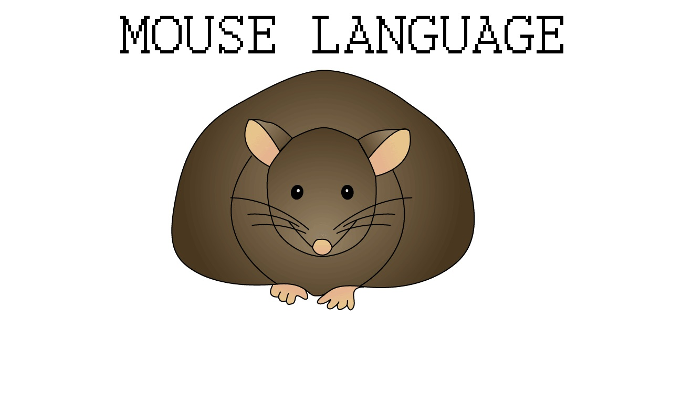

# MOUSE PROGRAMMING LANGUAGE
This repository contains an interpreter written in C for the Mouse Programming Language as described by Peter Grogono in 1979:

[Byte Magazine Volume 04 Number 07](https://archive.org/details/byte-magazine-1979-07-rescan/page/n199/mode/2up)  

You can find a copy of the magazine in the "DOC" folder.

The "DATA" folder contains some examples program from the original papers.

# USAGE
.EXE filename

# EXAMPLE
debug.exe .\DATA\test.m79

```

Arithmetic Expressions: 1000=1000=1000=1000=1000
Boolean Expressions: 0=0=0=0=0=0=0=0=0    1=1=1=1=1=1=1=1=1
Assignments: 1000=1000=1000=1000
Conditional Statements: OK
Loops: 0 1 2 3 4 5 6 7 8 9 10

   0 0 0 0 0 0
   0 1 2 3 4 5
   0 2 4 6 8 10
   0 3 6 9 12 15
   0 4 8 12 16 20
   0 5 10 15 20 25

Macro Calls:  A: OK
Parameters:  B: OK OK C: 10=10 D: 10=10
Scope of Variables:  E: 1000=1000
Recursive Macros:  G: 2 3 3 5 7
End of tests.
```  
